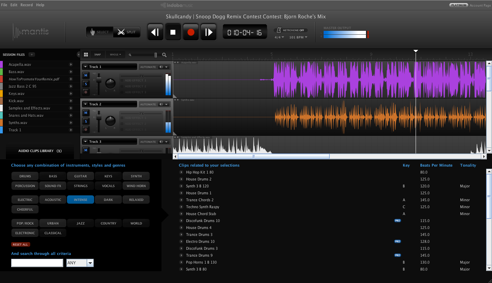
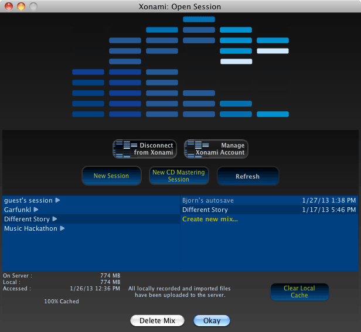
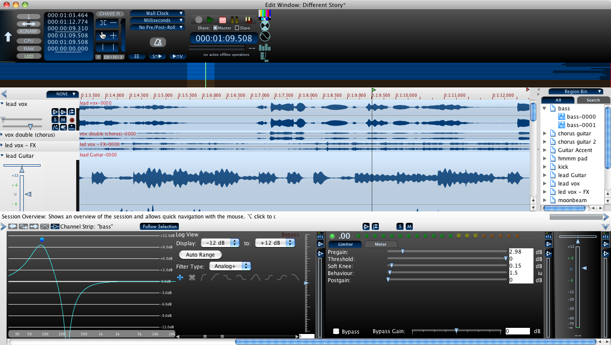

SJWidgets - Screenshots
======================

SJWidgets has been used in Indaba Music's Mantis Web based Audio Editor:

It is also being used in XO Audio's upcoming Xonami Collaborative audio
editor. The opening screen shows a simple selector

and the main edit window is a complex window with many buttons, toggles,
and other options, all made using SJWidgets.

